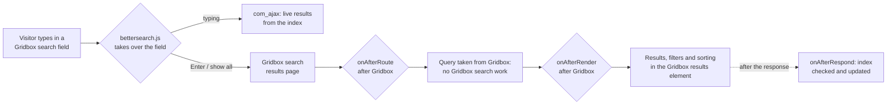

# Better Search for Balbooa Gridbox (Joomla 6 Package)

[-orange?style=for-the-badge)](https://www.balbooa.com/joomla-gridbox)

A native Joomla 6 extension that replaces the **Balbooa Gridbox store search** — the live results under the search fields and the search results page — with a search that finds products **the way shoppers type them**, from its own index.

Out of the box, Gridbox splits the query into words and looks for each of them separately. A model code typed differently than in the product name is not found or finds unrelated products: on a measurement equipment store `MI3155` finds one product, `MI-3155` another one, and `MI 3155` a dozen meters that contain “mi” somewhere. Better Search treats **`MI 3155`, `MI3155`, `MI-3155` and `mi.3155` as the same product**, even when the description writes only one of these forms — and lets the shop owner decide what comes first.

---

## ⚡ Key Highlights & Capabilities

* **Model codes match however they are typed:** Neighbouring parts of a code are joined (`MI 3155` → `mi3155`, `MPI 530` → `mpi530`, `5 kv` → `5kv`) and compared with the product text without spaces, dashes or dots. A short word after another one is its ending written apart: `eurotest xd` finds *EurotestXD*.
* **Own search index:** Names, product codes (also of variants), chosen product fields, categories with their parent categories, tags and — with a much lower weight — intro texts, meta data and the text of the product page. Descriptions use a MySQL full-text index when the server allows it.
* **Always up to date, without cron:** Gridbox saves products without notifying other extensions. The plugin compares a signature of every product (name, save time, categories, codes, prices, stock, fields, tags) with the index **after the page has been sent** to the visitor, and indexes new and changed products in batches. Publishing, access and dates are checked live, so they need no reindex.
* **Polish shoppers' habits:** word endings (`mierników` → *miernik*, `kamery` ~ *kamera*), typo correction (`eurotset` → *eurotest*, `miernk` → *miernik*), synonyms (`multimetr, miernik uniwersalny`; one-way `rcd => wyłącznik różnicowoprądowy`), ignored words, partial matches with a note when no product has all the words.
* **Manual ranking:** **Query rules** pin products to the top of chosen queries **in the order you set** (drag and drop) or hide them; the query is matched exactly, by its start or anywhere, and spaces or dashes in it do not matter. **Product boosts** and **category boosts** move products up or down in every search.
* **Exclusions:** excluded categories (with or without their subcategories), excluded products, products out of stock shown normally, at the end or hidden. Subscription add-ons hidden by Gridbox stay hidden.
* **Explainable relevance:** weights per field (code, name, fields, categories, descriptions), a factor for words with digits, popularity (page views) and a cut-off of weak matches. The **test console** shows every result with its score and the reasons.
* **Live results under every Gridbox search field:** categories matching the query, products grouped by app (store, blog…), price, category, code, availability, short description, a *show all results* button; keyboard navigation (arrows, Enter, Escape) and ARIA combobox semantics; a **full-screen search on phones** with its own field — the keyboard opens with the first tap (fixed in 1.1.0).
* **Appearing effects (new in 1.1.0):** the panel fades in, slides up or down, zooms, flips down or unrolls from the top; the results inside it fade in, rise, slide in, zoom or sharpen from blur, one after another — each with its own duration and delay. Visitors who ask their system for less motion see none.
* **Live preview in the settings (new in 1.1.0):** the live results and the results page rendered from the settings in the form, before you save — real products, at desktop, tablet and phone width.
* **Results page in the Gridbox results element:** category and app filters with counts, sorting (best match, name, price, newest, most viewed), page numbers and/or *load more*, grid or list. Gridbox does no search work on that page at all.
* **Full visual control:** width (as the field / at least / fixed), height, alignment and distance of the live results; list or grid; image left / right / top, size, proportions, fit, shape and background; columns for desktop / tablet / phone; card colours, border, radius, padding, shadow and hover effect; text alignment; what each result shows; every text shown on the site.
* **Prices like in the store:** sale prices, active store sales and variations (“from …”), in the currency picked in Gridbox's currency switcher, formatted like Gridbox.
* **Fast WebP thumbnails:** a 64 px result image is a ~1.5 KB WebP copy instead of a full-size photo — made once, kept on the server, EXIF rotation and transparency preserved.
* **Search statistics:** most searched queries, **queries without results** (what shoppers miss) and recent ones — no personal data.
* **A module for any place:** `mod_bettersearch` — a search field with the same live results, for places without a Gridbox search element.
* **Administrator menu entry:** *Better Search for Gridbox* appears in the Joomla 6 administrator menu and opens the plugin settings directly.

---

## 🛠️ How It Works

1. **Index.** `#__bettersearch_items` keeps, per Gridbox page, the words of each field and the same text with every separator removed. Neighbouring parts of model codes are also stored joined and split (`MI3155` → *mi*, *3155*, *mi3155*).
2. **Query.** The query is cut into groups — parts of a model code form one group — and each group gets its alternatives (synonyms, word stem, a joined ending). Every group must be found; candidates come from one SQL query, the ranking is computed in PHP.
3. **Fallbacks.** Nothing found: the parts of a code as separate words → typo correction against the words of the index → products with most of the words (with a note).
4. **Rules.** Pinned products of matching rules go first in the set order, hidden ones are removed, boosts and exclusions apply, then the chosen sorting.
5. **Live results.** The script listens in the capture phase, so Gridbox's own live search never runs; results come from `com_ajax` and are cached per query, visitor access levels, language, device and currency.
6. **Results page.** The plugin runs **after Gridbox** in `onAfterRoute` (Gridbox's redirect to the SEF address keeps the query) and empties the query for Gridbox; in `onAfterRender` (again after Gridbox) it puts its own block into the Gridbox results element and the query into the Gridbox headline.

Gridbox files and tables are never modified. The plugin writes only its own tables (index, state, statistics) and the thumbnails in `media/plg_system_bettersearch/thumbs`. Disabling the plugin restores the Gridbox search instantly.

---

## 🚀 Installation & Package Structure

1. Download `pkg_bettersearch-1.2.0.zip` from [Releases](https://github.com/merserwis/plg_system_bettersearch/releases).
2. In the Joomla administrator go to **System → Install → Extensions** and upload the package.
3. On a fresh install the plugin is **enabled automatically**; an update keeps whatever you chose before. If Balbooa Gridbox is not installed, the installer says so in a notice.
4. Open **Better Search for Gridbox** in the administrator menu (or *System → Plugins → System - Better Search for Gridbox*).
5. On the **Search engine** tab choose the **product fields to search** (manufacturer, model, parameters). Leave out fields shared by many products, such as contact persons — every product would match their names.
6. On the **Index & tools** tab click **Update index**. The index is also built automatically on the first visits (in batches of 300 products, the next batch half a minute later) and kept up to date afterwards.

| Extension | Type | Purpose |
|---|---|---|
| `plg_system_bettersearch` | System plugin | Index, live results, results page, administrator tools. |
| `com_bettersearch` | Administrator component | Menu entry *Better Search for Gridbox* that opens the plugin settings. |
| `mod_bettersearch` | Site module | A search field with the live results, e.g. in a Gridbox *Joomla Module* element. |
| `pkg_bettersearch` | Package | Installs and updates all three in one step. |

Uninstalling the package removes all three extensions and the plugin's tables (index, state, statistics).

**Updates:** the package registers the update server `https://raw.githubusercontent.com/merserwis/plg_system_bettersearch/main/update.xml`, so new releases appear in *System → Update → Extensions*. Joomla verifies each download against the SHA-256 checksum in `update.xml`.

---

## 👀 Live Preview

The *Live results*, *Results page* and *Texts & images* tabs have a **live preview column**. It shows exactly what the plugin renders — real products, categories, prices and images from your store, as a guest of the site sees them — using the values currently in the form, before you save.

* **Live results:** the panel opened under a search field of a mock page header, at its configured width, alignment and distance; on *Phone* the full-screen search. **Replay** shows the appearing effects again.
* **Results page:** the results block under the Gridbox headline, with filters, sorting and cards.
* **Desktop (1280 px), Tablet (820 px) and Phone (390 px):** the preview renders at the real device width, scaled to fit, so columns per device and all responsive rules apply as on the site. The desktop preview of the live results is as wide as the panel, so it stays readable.
* Type any **query for the preview**; it starts with the most searched query with results. Links in the preview are inactive.

---

## 🧰 Index & Tools

The **Index & tools** tab of the plugin:

* **Search index** — indexed products / pages, products waiting for indexing, searched apps, time of the last check and of the last complete update. **Update index** (new and changed products) and **Rebuild everything** (every product again; the search keeps working meanwhile) with a progress bar; **Clear cache**; **Delete small images**.
* **Test search** — the results of any query **as a guest sees them**, with the score of each result and its reasons (e.g. `mi3155:title exact +15.0`, `phrase +23.3`, `views +2.9`, `pinned by rule`), the search mode and how the query was understood. It uses the settings of the form **before they are saved**, so weights, rules and boosts can be tried out first.
* **Search statistics** — most searched queries, queries without results and recent ones, as tabs with one full-width table each (counts on the tabs); a click on a query runs it in the test console.

---

## ⚙️ Configuration Reference

Empty colour fields mean **“use the Gridbox theme value”**; the accent colour defaults to the primary colour of the Gridbox theme. Changing the settings of the *Search engine* tab marks all products for indexing (gradually, or at once with *Rebuild everything*).

### Settings

| Option | Default | Description |
|---|---|---|
| Searched apps | *(empty)* | Gridbox apps whose pages are found. Empty = every store app. Add blog apps to find articles too (they are shown as their own group). |
| Live results | Yes | Results under the search field while typing. Off = the field only leads to the results page. |
| Replace the results page | Yes | The Gridbox search results page shows the results of this plugin (Gridbox does not search at all). |
| Results page address | *(empty)* | Where Enter and “Show all results” lead, e.g. /szukaj. Empty = the address set in the Gridbox search element (or the Gridbox store search page). |
| Search fields (CSS selector) | *(empty)* | Fields taken over by the plugin. Empty = the Gridbox search fields and the field of the Better Search module. |
| Load on every page | No | The script is added only to pages with a Gridbox search field. Turn on when you use an own selector for fields of other extensions. |
| Magnifier icon searches | Yes | Clicking the icon of a Gridbox search field opens the results page (Gridbox uses it to clear the field). |
| Update the index automatically | Yes | Gridbox saves products without notifying other extensions. The plugin compares the products with the index after a visitor's page has been sent and indexes new and changed ones. |
| Check every (minutes) | `10` | How often the index is compared with Gridbox. A changed product can be found under its new name after at most this time. |
| Products per check | `300` | At most this many products are indexed in one automatic check; the rest follows in the next ones. |
| Cache results (minutes) | `15` | Results of the same query are kept for this time. Every index update and every change of settings starts afresh. 0 = no cache. |
| Search statistics | Yes | Counts the queries of the results page (no personal data): most searched, without results. See tab “Index & tools”. |

### Search engine

| Option | Default | Description |
|---|---|---|
| Product fields to search | *(empty)* | Values of these Gridbox fields are found (e.g. manufacturer, model, parameters). Leave out fields shared by many products, such as contact persons — they would make every product match their names. |
| Search variant codes (SKU) | Yes |  |
| Search parent category names | Yes | A query with a category name also finds the products of its subcategories. |
| Search tags | Yes |  |
| Search descriptions | Yes | Words found only in descriptions count much less than in names, codes, fields and categories. |
| Intro text | Yes |  |
| Meta description and keywords | Yes |  |
| Page content | Yes | The text of the product page layout (tabs, descriptions, specifications). |
| Characters of description per product | `20000` |  |
| Minimum query length | `2` |  |
| Word endings | Yes | “mierników” also finds “miernik”, “mierniki”. Light rules for Polish. |
| Typo correction | Yes | When nothing is found, words unknown to the index are replaced by the closest known word (“eurotset” → “eurotest”). |
| Partial matches | Yes | When no product has all the words, show the products with most of them (with a note). |
| Cut weak matches (%) | `15` | Results scoring below this percentage of the best result are left out (e.g. products that only mention the word deep in the description). 0 = keep all. |
| Synonyms | *(empty)* | One group per line, comma separated: `multimetr, miernik uniwersalny` — each finds the others. One-way: `rcd => wyłącznik różnicowoprądowy`. Lines starting with # are ignored. |
| Ignored words | `i, w, z, ze, na, do, dla, od, po, o, u, a, oraz, lub, czy, the, and, of, for, with, to, in` | Comma separated. Ignored unless the query has nothing else, and never inside a model code (“A 1199”). |
| Product code (SKU) | `12` |  |
| Name | `10` |  |
| Fields | `4` |  |
| Categories and tags | `3` |  |
| Descriptions | `1` |  |
| Words with digits × | `1.5` | Model numbers say more than words: their weight is multiplied by this factor. |
| Popularity | `1` | Points for page views (logarithmic): with equal matches, the more viewed product goes first. 0 = off. |
| Maximum candidates per query | `3000` |  |

### Ranking & exclusions

| Option | Default | Description |
|---|---|---|
| Query rules | *(none)* | Pinned or hidden products for given queries. Row: Enabled, Queries, Query, Action, Products, Note. |
| Product boosts | *(none)* | Points added to the score of a product in every search where it is found (a name match is worth about 10). Row: Product, Points. |
| Category boosts | *(none)* | Points for the products of a category and its subcategories (negative = lower, e.g. accessories). Row: Category, Points. |
| Excluded categories | *(empty)* | Products of these categories are never found. |
| With subcategories | Yes | Yes = also products of the subcategories and products that have the category as an additional one. No = only products whose main category is excluded. |
| Excluded products | *(empty)* | These products are never found. |
| Products out of stock | No difference | No difference / At the end / Hidden |
| Default order | Best match | Best match / Name A–Z / Name Z–A / Price: lowest first / Price: highest first / Newest / Most viewed |

### Live results

| Option | Default | Description |
|---|---|---|
| Start after characters | `2` |  |
| Delay (ms) | `220` | Pause in typing before the results are asked for. |
| Products shown | `8` |  |
| Group by app | Yes | With several searched apps (store, blog…): one section each. |
| Items of other apps | `3` |  |
| Matching categories | Yes | Categories whose name matches the query, above the products. |
| Categories shown | `4` |  |
| Section titles | Yes |  |
| “Show all results” button | Yes |  |
| Panel appears with | Slide up | How the live results panel appears under the field. Visitors who asked their system for less motion see no effect. Options: No effect / Fade in / Slide up / Slide down / Zoom in / Flip down / Unroll from the top. |
| Panel effect duration (ms) | `200` |  |
| Results appear with | No effect | How the results inside the panel appear, one after another — also each time new results come while typing. Options: No effect / Fade in / Fade in from below / Slide in from the left / Zoom in / Sharpen from blur. |
| Result effect duration (ms) | `260` |  |
| Delay between results (ms) | `35` | Each next result starts this much later. 0 = all at once. |
| Width | At least the given width | Width of the field, at least the given width, or always the given width (never wider than the screen). |
| Width (px) | `640` |  |
| Maximum height (px) | `560` |  |
| Alignment to the field | Left | Left / Centre / Right |
| Distance from the field (px) | `8` |  |
| Layout | List | List / Grid |
| Columns | `3` |  |
| On phones | Full screen | Full screen: the search opens over the whole page with its own field (convenient with the on-screen keyboard). |
| Full screen up to width (px) | `768` |  |
| Image | Yes |  |
| Image position | Left | Left / Right / Top |
| Image size (px) | `64` |  |
| Image shape | Rounded | Square corners / Rounded / Circle |
| Image fit | Whole image | Whole image / Fill (crop) |
| Background under images | `#ffffff` |  |
| Price | Yes |  |
| Category | Yes |  |
| Product code (SKU) | No |  |
| Availability | No |  |
| Short description | No |  |
| Description length (characters) | `90` |  |
| Name: maximum lines | `2` |  |
| Font size (px) | `14` |  |
| Background | `#ffffff` |  |
| Text colour | `#1f2328` |  |
| Secondary text colour | `#6b7280` |  |
| Accent colour | *(theme)* | Buttons, active items, chips. Empty = the primary colour of the Gridbox theme. |
| Background of the pointed item | `#f3f4f6` |  |
| Border colour | `#e5e7eb` |  |
| Corner radius (px) | `10` |  |
| Shadow | Strong | None / Soft / Strong |
| Stacking (z-index) | `99999` |  |

### Results page

| Option | Default | Description |
|---|---|---|
| Heading | Gridbox headline + query | Gridbox = the headline element of the Gridbox page followed by the query. Own = a heading from the tab “Texts & images” (the Gridbox headline is hidden). |
| Number of results | Yes |  |
| Sorting list | Yes |  |
| Sorting options | Best match (always), Name A–Z, Price: lowest first, Price: highest first, Newest | Options of the sorting list. |
| Category filter | Yes | Buttons with the categories of the results and their counts. |
| Categories in the filter | The product's own category | The product's own category / Top-level category |
| Categories in the filter (max) | `12` |  |
| App filter | Yes |  |
| Results per page | `24` |  |
| More results | Button and page numbers | Page numbers / “Load more” button / Button and page numbers |
| Layout | Grid | Grid / List |
| Columns: desktop | `4` |  |
| Columns: tablet (≤ 1024 px) | `3` |  |
| Columns: phone (≤ 768 px) | `2` |  |
| Gap (px) | `20` |  |
| Maximum width (px) | `0` | 0 = the width of the Gridbox element. |
| Image | Yes |  |
| Image position | Top | Left/right in the list layout or next to the text in the grid. On phones with several columns side images go on top. |
| Image width (% of the card) | `32` |  |
| Image proportions | 1:1 | 1:1 / 4:3 / 3:2 / 16:9 / 3:4 / As the image |
| Image fit | Whole image | Whole image / Fill (crop) |
| Image shape | Square corners | Square corners / Rounded / Circle |
| Background under images | `#ffffff` |  |
| Text alignment | Left | Left / Centre |
| Category | Yes |  |
| App name | No |  |
| Name: HTML tag | H3 | H2 / H3 / H4 / DIV |
| Product code (SKU) | No |  |
| Short description | Yes |  |
| Description length (characters) | `140` |  |
| Price | Yes |  |
| Availability | No |  |
| Button | Yes |  |
| Font size (px) | `14` |  |
| Name: font size (px) | `16` |  |
| Name: maximum lines | `2` |  |
| Name colour | *(theme)* |  |
| Text colour | `#4b5563` |  |
| Price colour | *(theme)* |  |
| Accent colour | *(theme)* | Buttons, active items, chips. Empty = the primary colour of the Gridbox theme. |
| Card background | `#ffffff` |  |
| Border colour | `#e5e7eb` |  |
| Corner radius (px) | `10` |  |
| Card padding (px) | `16` |  |
| Shadow | None | None / Soft / Strong |
| Pointer over a card | Lift | Nothing / Lift / Shadow / Zoom the image / Accent border |

### Texts & images

| Option | Default | Description |
|---|---|---|
| Mark the query in results | Yes |  |
| Mark background | *(theme)* |  |
| Mark colour | *(theme)* |  |
| No results | *(empty)* | Default: “No results for %s.”. |
| Corrected query | *(empty)* | Default: “Showing results for %s.”. |
| Partial matches | *(empty)* | Default: “No product matches all the words — showing the closest results.”. |
| Own heading | *(empty)* | Default: “Results for “%s” (%d)”. |
| Number of results | *(empty)* | Default: “Results: %d”. |
| “Show all” button | *(empty)* | Default: “Show all results (%d)”. |
| Categories section | *(empty)* | Default: “Categories”. |
| Products section | *(empty)* | Default: “Products”. |
| Card button | *(empty)* | Default: “View”. |
| Sorting label | *(empty)* | Default: “Sort by”. |
| “Load more” button | *(empty)* | Default: “Load more”. |
| Price “from” | *(empty)* | Default: “from”. |
| Product code label | *(empty)* | Default: “Code:”. |
| Available | *(empty)* | Default: “Available”. |
| Not available | *(empty)* | Default: “Not available”. |
| Empty query | *(empty)* | Default: “Type what you are looking for.”. |
| Small images (WebP) | Yes | Results load reduced WebP copies of product images instead of the originals (made once, kept in media/plg_system_bettersearch/thumbs). |
| WebP quality | `80` |  |
| Time for new small images per page view (s) | `0.5` | New images are converted while a page is built; after this time the originals are used and the next page view continues. Live results get at most 0.25 s. |

### Module (mod_bettersearch)

| Option | Default | Description |
|---|---|---|
| Placeholder | *(empty)* | Empty = “Search…” in the site language. |
| Width | `100%` | CSS width, e.g. `100%`, `420px`. |
| Height (px) | `44` | |
| Font size (px) | `15` | |
| Corner radius (px) | `8` | |
| Background / Text colour / Border colour | `#ffffff` / `#1f2328` / `#d0d5dd` | |
| Button | Magnifier | *Magnifier* or *None*; Enter always searches. |
| Button colour | *(text colour)* | |

The live results of the module field use the settings of the plugin.

---

## 🧪 Verification & Testing

Versions 1.0.0 to 1.2.0 were tested on **Joomla 6.1.3 with PHP 8.5.10**, MySQL 8.0 and **Gridbox 2.20.3.1**, with **636 real products** of a measurement equipment store (179 categories, product codes, prices, variations, a select field and a text field), a blog app, unpublished and registered-only products.

1. **Model codes** — `MI 3155`, `MI3155`, `MI-3155`, `mi.3155` and `metrel mi 3155` return the same product first; `MPI 530` = `MPI530`; `ht 7051` = `HT7051`; `eurotest xd` = *EurotestXD*; `miernik izolacji 5 kv` = `5kv`.
2. **Fallbacks** — `eurotset` → *eurotest*, `miernk izolacji` → *miernik izolacji*; partial matches limited to products with at least half of the words; a fixed list of 41 queries kept as a regression baseline.
3. **Rules and exclusions** — pinned order kept (also for `MPI`, `Sonel-MPI` and *starts with*), hidden products removed, a +100 boost moves the last result to the top, excluded categories with and without subcategories, excluded products, products out of stock hidden; unpublished and registered-only products never shown to guests.
4. **Speed** — with 4 452 products and ~12 KB of description each: **30–70 ms per uncached query** (full-text index; 65–215 ms without it), a few milliseconds from the cache; indexing about 1 000 products per second.
5. **Browser** — live results on desktop and phone (full screen), keyboard navigation, the results page with filters, sorting, page numbers and *load more* (no duplicates, sorting kept), grid and list layouts, the module field; no JavaScript errors, no horizontal scrolling.
6. **Administrator** — all tabs, product pickers with search and drag-and-drop order inside repeatable rows, saving through the form, index tools, test console and statistics.
7. **Package** — fresh install (tables and full-text index created, plugin enabled), update over 1.0.0 keeping settings and index, uninstall without leftovers, reinstall.
8. **Code health** — no PHP warnings, notices or deprecated Joomla API calls from the extension with full error reporting.
9. **1.2.0** — penetration tests on the live results, the results page, the module and the administrator tools: XSS payloads (also through POST), SQL and full-text operator injection, LIKE wildcards, CSRF without a token, administrator tasks as a guest, path traversal in image paths, CSS injection through colour settings, long and many-word queries; store sales (global, category, parent category, order of sales); an unpublished product disappearing from cached results within a minute; chips against their result pages; load more; the Gridbox items filter on a Gridbox page; parallel requests running one index check; expired cache files removed; update 1.1.0 → 1.2.0 with settings and index kept.
10. **1.1.0** — on an emulated phone (touch, iPhone User-Agent) a tap on the search field focuses the full-screen field within the tap itself and typing shows results; every appearing effect in the browser; the live preview for the live results (desktop, tablet, phone full screen, grid) and the results page, following unsaved form changes; statistics tabs with long queries. Ranking identical to 1.0.0 for all 41 regression queries; updating from 1.0.0 keeps all settings and the index.

Quick check on your site: open the search results page and look for `
` —
plugin version, the detected device and the time spent on the results. A search error is reported in a comment in place of the results, never as a broken page.
The plugin always uses its settings as saved in the database, even when the site hands it a different copy (some device-specific extensions or caches pass phones old plugin parameters).

---

## 🔒 Security & Performance

* **Own data only:** the plugin reads Gridbox tables and writes only its own tables and the thumbnails inside its own media folder, from images inside the site (paths are resolved and checked to stay in the site root).
* **Access-aware:** results respect Joomla view levels, publishing state, publish-up / publish-down dates and language, like Gridbox's own listings; the test console shows what a guest sees.
* **Administrator actions protected:** index tools, the test console, product search and statistics need an administrator session with the right to manage plugins and a security token.
* **Escaped output:** queries, titles, URLs and image paths are HTML-escaped; database values are quoted; colours and sizes are validated before they reach the CSS.
* **Privacy:** statistics store only the query text, counts and the time of the last search — no IP addresses, no user data; bots are not counted.
* **Fast:** cached results per query; index updates run after the response has been sent; one small script without dependencies, loaded only on pages with a search field; lazy-loaded WebP thumbnails.
* **Robust on phones:** device-specific values are set from the User-Agent as well as with `@media` rules, because some sites strip `@media` rules from the HTML served to phones.

---

## 📋 Requirements

| Component | Version |
|---|---|
| Joomla | 6.x (tested on 6.1.3) |
| PHP | 8.2 – 8.5 |
| Balbooa Gridbox | Store (*Products*) app; tested with 2.20.3.1 |
| Database | MySQL / MariaDB (full-text index used when available) |
| PHP intl | optional: names sort in the order of the site language |

With a page cache (Gridbox performance cache, *System - Page Cache* or a proxy) results pages are cached like other pages: clear the cache after larger catalogue changes.

---

## 📝 Changelog

* **1.2.0** — Security, correctness and performance release after a code review with penetration tests: current visibility of cached results, bounded resource use, Gridbox items filter no longer broken, searches with `<`, ordered candidates before the limit, store sales priced as Gridbox does, far fewer database queries, cheaper thumbnails and index upkeep, cache clean-up.
* **1.1.0** — Live preview in the settings. Appearing effects of the live results panel and of the results inside it. Phones: the keyboard opens with the first tap on the search field. Search statistics as tabs.
* **1.0.0** — First release.

---

## 📄 License & Maintainer

* **License:** [GNU General Public License version 3](https://www.gnu.org/licenses/gpl-3.0.html) (GPL-3.0).
* **Maintainer:** [Merserwis](https://github.com/merserwis/)
* *Balbooa* and *Gridbox* are trademarks of their respective owners. This project is not affiliated with Balbooa.
